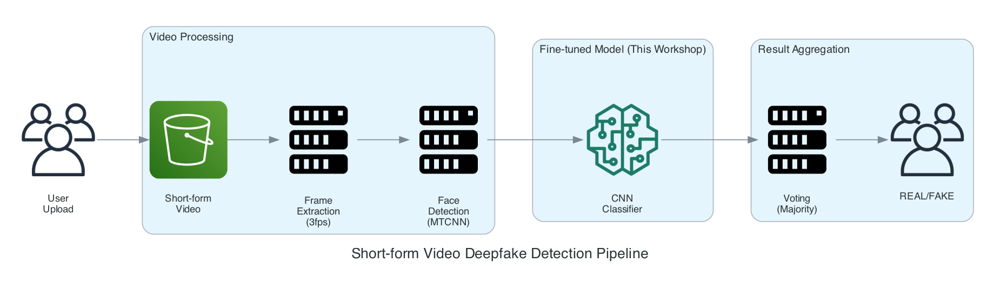
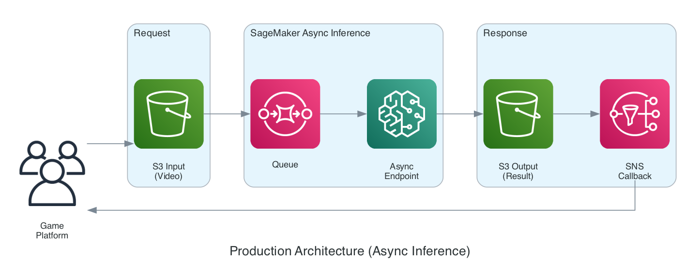

# 🎭 숏폼 딥페이크 영상 판별 모델 Fine-tuning 워크샵

## 개요

**숏폼 영상(틱톡, 릴스, 쇼츠 등)의 딥페이크 여부를 판별하는 AI 모델을 Fine-tuning하는 실습입니다.**

게임 플랫폼, 콘텐츠 검증 서비스 등에서 활용할 수 있는 딥페이크 영상 탐지 모델을 Amazon SageMaker 기반으로 학습하고 배포합니다.

| 구분 | Before | After |
|------|--------|-------|
| 모델 | FaceForensics++ Pretrained | KoDF Fine-tuned |
| 학습 데이터 | 서양인 얼굴 위주 | 한국인 얼굴 추가 |
| 한국인 영상 정확도 | ~70% | ~90%+ |

## 영상 딥페이크 탐지 파이프라인



**숏폼 영상 분석 흐름:**
1. **영상 업로드**: 사용자가 숏폼 영상(15~60초) 업로드
2. **프레임 추출**: 3fps로 프레임 샘플링 (30초 영상 → 90프레임)
3. **얼굴 탐지**: MTCNN으로 각 프레임에서 얼굴 영역 추출
4. **CNN 분류**: Fine-tuned 모델로 각 프레임 REAL/FAKE 판별
5. **결과 종합**: 다수결 투표로 최종 영상 판정

> 💡 **이 워크샵에서는** CNN 분류기(4번)를 Fine-tuning합니다. 이것이 영상 탐지의 핵심 엔진입니다.

## 워크샵 아키텍처


## 실습 단계

| 단계 | 폴더 | 내용 | 예상 시간 |
|------|------|------|----------|
| 1 | `1_data_preparation/` | KoDF 샘플 데이터 준비 & S3 업로드 | 30분 |
| 2 | `2_before_evaluation/` | Pretrained 모델 성능 평가 (Before) | 20분 |
| 3 | `3_fine_tuning/` | SageMaker Fine-tuning (Full, Freeze, LoRA) | 40분 |
| 4 | `4_after_evaluation/` | Fine-tuned 모델 성능 평가 (After) | 20분 |
| 5 | `5_comparison/` | Before vs After 비교 시각화 | 15분 |
| 6 | `6_demo/` | Endpoint 배포 & 영상 데모 | 30분 |

## Fine-tuning 기법 비교

| 기법 | 학습 파라미터 | 장점 | 적합한 경우 |
|------|--------------|------|------------|
| **Full Fine-tuning** | 전체 (~4M) | 최고 성능 | 데이터 충분, 성능 중요 |
| **Layer Freezing** | Classifier만 (~2K) | 빠름, 안정적 | 데이터 적음, 빠른 실험 |
| **LoRA** | Adapter (~10K) | 효율적, 좋은 성능 | 대규모 모델, LLM |

## 프로덕션 적용 가이드

실제 게임 플랫폼 등에 적용 시, **비동기 추론(Async Inference)** 아키텍처를 권장합니다:



**비동기 추론의 장점:**
- 영상 분석(수 초 소요)에 적합
- Scale to Zero: 트래픽 없을 때 비용 0원
- SNS 콜백으로 결과 전달

## 사전 준비

### 필수 요구사항
- AWS 계정 (SageMaker 접근 권한)
- Python 3.8+
- AWS CLI 설정 완료

### AWS 리소스
- S3 버킷
- SageMaker 노트북 인스턴스 또는 Studio
- IAM Role (SageMaker 실행 권한)

## 빠른 시작

```bash
# 1. 의존성 설치
pip install -r requirements.txt

# 2. 노트북 순서대로 실행
# 1_data_preparation/prepare_data.ipynb
# 2_before_evaluation/evaluate_before.ipynb
# 3_fine_tuning/run_finetuning.ipynb
# 4_after_evaluation/evaluate_after.ipynb
# 5_comparison/compare_results.ipynb
# 6_demo/deploy_and_demo.ipynb
```

## 예상 비용

| 리소스 | 인스턴스 | 사용량 | 예상 비용 |
|--------|----------|--------|----------|
| SageMaker Training | ml.g4dn.xlarge (Spot) | 1시간 | ~$0.25 |
| SageMaker Endpoint | ml.g4dn.xlarge | 2시간 | ~$1.4 |
| S3 Storage | - | 1GB | ~$0.02 |
| **총합** | | | **~$1.7** |

## 심화: 시공간 분석 모델

본 워크샵은 **프레임 기반 분석** 방식입니다. 더 정교한 시공간 분석이 필요한 경우:

| 모델 | 특징 | 적용 |
|------|------|------|
| **ViViT** | Video Vision Transformer | 시간적 패턴 분석 |
| **TimeSformer** | 시공간 어텐션 | 긴 영상 분석 |
| **X3D** | 효율적 3D CNN | 실시간 분석 |

> 시공간 모델에도 LoRA 기법을 동일하게 적용할 수 있습니다.

## 참고 자료

- [KoDF 데이터셋](https://www.aihub.or.kr/)
- [FaceForensics++ 벤치마크](https://github.com/ondyari/FaceForensics)
- [Amazon SageMaker 문서](https://docs.aws.amazon.com/sagemaker/)

## 라이선스

이 워크샵 자료는 교육 목적으로 제공됩니다.
