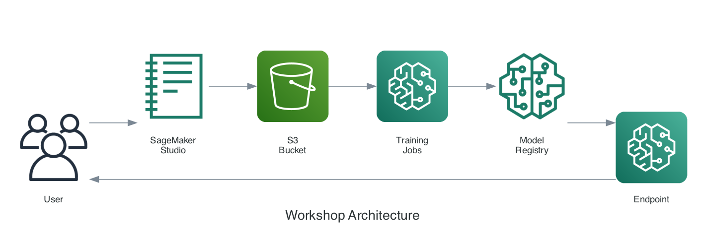

# 딥페이크 탐지 모델 Fine-tuning Workshop

## Workshop 소개

글로벌 딥페이크 탐지 모델(FaceForensics++)을 **한국인 얼굴에 특화**되도록 Fine-tuning하는 실습입니다.

## 핵심 목표

| 구분 | Before | After |
|------|--------|-------|
| 모델 | FaceForensics++ Pretrained | Fine-tuned |
| 학습 데이터 | 서양인 얼굴 위주 | + 한국인 얼굴 |
| 한국인 탐지 정확도 | ~70% | **~90%+** |

## Fine-tuning 기법 비교 (핵심!)

이 Workshop에서는 **세 가지 Fine-tuning 기법**을 직접 비교합니다:

| 기법 | 학습 파라미터 | 장점 | 단점 | 적합한 경우 |
|------|--------------|------|------|------------|
| **Full Fine-tuning** | 전체 (~4M) | 최고 성능 | 과적합 위험, 느림 | 데이터 충분, 성능 중요 |
| **Layer Freezing** | Classifier만 (~2K) | 빠름, 안정적 | 성능 제한 | 데이터 적음, 빠른 실험 |
| **LoRA** | Adapter (~10K) | 효율적, 좋은 성능 | 구현 복잡 | 대규모 모델, LLM |

## 실습 흐름

```
Step 1: 데이터 준비
    ↓
Step 2: Before 평가 (Fine-tuning 전)
    ↓
Step 3: 3가지 Fine-tuning 기법 비교 ★
    ↓
Step 4: After 평가 (기법별 성능 비교)
    ↓
Step 5: Before vs After 종합 비교
    ↓
Step 6: 최고 성능 모델로 데모 배포
```

## 실습 방법

> **모든 노트북은 셀을 순서대로 실행하면 됩니다. (`Shift + Enter`)**

## 주요 기능

| 기능 | 설명 |
|------|------|
| **3가지 Fine-tuning 기법** | Full, Freeze, LoRA 비교 실습 |
| **SageMaker Experiments** | 하이퍼파라미터, 메트릭 자동 추적 |
| **Model Registry** | 모델 버전 관리 (85%+ 시 등록) |
| **Spot Instance** | 학습 비용 ~70% 절감 |

## 아키텍처



## 예상 소요 시간

| 단계 | 내용 | 시간 |
|------|------|------|
| 1 | 데이터 준비 | 15분 |
| 2 | Before 평가 | 10분 |
| 3 | Fine-tuning (3가지 기법) | 45분 |
| 4 | After 평가 | 15분 |
| 5 | 성능 비교 | 10분 |
| 6 | 데모 배포 | 15분 |
| **총합** | | **~2시간** |

> 💡 시간이 부족하면 노트북 3에서 기법을 1~2개만 선택하여 실행할 수 있습니다.

## 예상 비용

| 리소스 | 인스턴스 | Spot 사용 시 |
|--------|----------|-------------|
| Training (3가지 기법) | ml.g4dn.xlarge × 3 | ~$0.66 |
| Endpoint | ml.g4dn.xlarge | ~$0.74/hr |
| S3 | - | ~$0.02 |
| **총합** | | **~$2.5** |

## 시작하기

👉 [사전 준비](getting-started/prerequisites.md)를 확인하세요.
