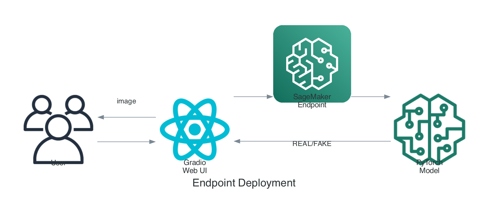

# 아키텍처 상세

## 전체 아키텍처


## 모델 아키텍처

### EfficientNet-B4 기반 분류기

**모델 흐름:**
1. **Input Image** (224x224x3)
2. **EfficientNet-B4 Backbone** (Frozen) - Stem Conv → MBConv Blocks → Head Conv
3. **Global Average Pooling**
4. **Classifier** (Trainable) - Dropout(0.4) → Linear(1792→2)
5. **Softmax Output** - [Real, Fake]

### 레이어 구성

| 레이어 | 파라미터 수 | 학습 여부 |
|--------|-------------|-----------|
| Stem | ~5K | Frozen |
| MBConv 1-7 | ~17M | Frozen |
| Head | ~2M | Frozen |
| Classifier | ~3.5K | **Trainable** |

## 데이터 파이프라인

### 전처리 흐름

**전처리 순서:**
1. Raw Video
2. Frame Extraction (fps=1)
3. Face Detection (MTCNN)
4. Face Alignment & Crop
5. Resize (224x224)
6. Normalize (ImageNet stats)
7. Training Ready Tensor

### 데이터 증강

학습 시 적용되는 증강:

```python
transforms.Compose([
    transforms.RandomHorizontalFlip(p=0.5),
    transforms.RandomRotation(10),
    transforms.ColorJitter(brightness=0.1, contrast=0.1),
    transforms.RandomResizedCrop(224, scale=(0.9, 1.0)),
])
```

## 추론 파이프라인

### 실시간 추론 흐름



**SageMaker Endpoint 함수:**
- `input_fn()`: Base64 decode, Preprocess
- `predict_fn()`: Model inference
- `output_fn()`: Format response

**응답 예시:**
```json
{
  "prediction": "FAKE",
  "confidence": 0.95,
  "fake_probability": 0.95
}
```

## 보안 고려사항

### IAM 권한

```json
{
  "Version": "2012-10-17",
  "Statement": [
    {
      "Effect": "Allow",
      "Action": [
        "sagemaker:CreateTrainingJob",
        "sagemaker:CreateEndpoint",
        "sagemaker:InvokeEndpoint"
      ],
      "Resource": "*"
    },
    {
      "Effect": "Allow",
      "Action": [
        "s3:GetObject",
        "s3:PutObject"
      ],
      "Resource": "arn:aws:s3:::your-bucket/*"
    }
  ]
}
```

### VPC 설정 (선택)

프로덕션 환경에서는 VPC 내에서 실행 권장:

```python
estimator = PyTorch(
    ...
    subnets=['subnet-xxxxx'],
    security_group_ids=['sg-xxxxx']
)
```
