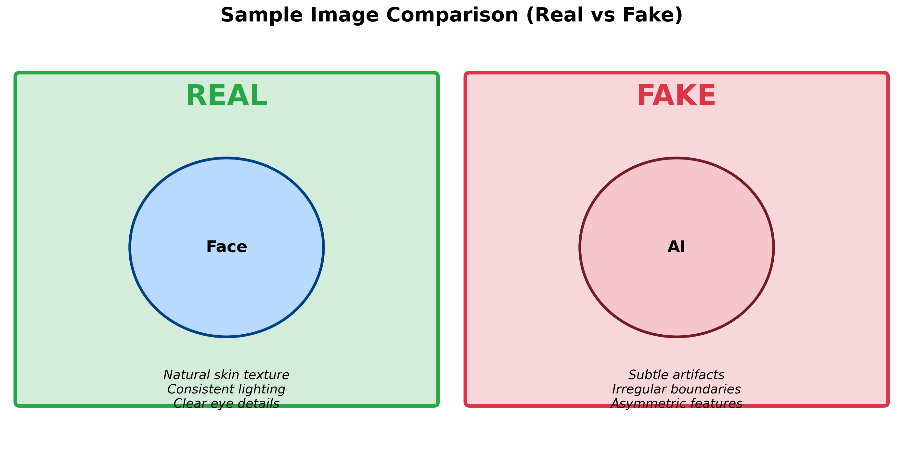

# 1. 데이터 준비

> 노트북: `1_data_preparation/prepare_data.ipynb`

## 개요

딥페이크 탐지 실습을 위한 데이터를 준비합니다.
**그냥 셀을 순서대로 실행하면 됩니다!**

## 학습 내용

- 딥페이크 탐지용 데이터셋 구조 이해
- Workshop 데이터 다운로드
- S3 버킷에 데이터 업로드
- config.json 생성

## 데이터 구성

| 구분 | Real | Fake | 합계 | 용도 |
|------|------|------|------|------|
| Train | 1,000장 | 1,000장 | 2,000장 | 모델 학습 |
| Validation | 200장 | 200장 | 400장 | 학습 중 검증 |
| Test | 200장 | 200장 | 400장 | Before/After 비교 |

## 단계별 실행 가이드

### Step 1: 노트북 열기

1. 왼쪽 파일 브라우저에서 `1_data_preparation` 폴더 클릭
2. `prepare_data.ipynb` 더블클릭

### Step 2: 환경 설정 (셀 1-2)

첫 번째 코드 셀을 실행합니다.

```python
import os
import boto3
import sagemaker
from pathlib import Path

PROJECT_ROOT = Path(os.getcwd()).parent
sagemaker_session = sagemaker.Session()
role = sagemaker.get_execution_role()
bucket = sagemaker_session.default_bucket()
```

**실행 방법:** `Shift + Enter`

**예상 출력:**
```
Project Root: /home/sagemaker-user/deepfake-detection-sagemaker
Region: ap-northeast-2
Role: arn:aws:iam::123456789012:role/...
Bucket: sagemaker-ap-northeast-2-123456789012
```

### Step 3: 데이터 다운로드 (셀 3-4)

Workshop 데이터를 CloudFront에서 다운로드합니다.

```python
CLOUDFRONT_URL = "https://d291vm7e8ubihi.cloudfront.net"
DATA_SOURCE = f"{CLOUDFRONT_URL}/sample-data"
# curl을 사용하여 각 이미지 다운로드
```

**예상 출력:**
```
데이터 소스: https://d291vm7e8ubihi.cloudfront.net/sample-data
데이터 다운로드 중... (약 1-2분 소요)

📥 train 데이터 다운로드 중...
  ✅ train/real: 1000장
  ✅ train/fake: 1000장
...
✅ 다운로드 완료! (총 2800장)
```

### Step 4: 데이터 확인 (셀 5)

다운로드된 데이터 구조를 확인합니다.

**예상 출력:**
```
데이터 디렉토리 구조:
./data
./data/train
./data/train/real
./data/train/fake
./data/val
./data/val/real
./data/val/fake
./data/test
./data/test/real
./data/test/fake

데이터 개수 확인:
train: Real=1000, Fake=1000, Total=2000
val: Real=200, Fake=200, Total=400
test: Real=200, Fake=200, Total=400

총 이미지 수: 2800장
```

### Step 5: 샘플 이미지 확인 (셀 6-7)

Real과 Fake 이미지 샘플을 시각화합니다.



| REAL | FAKE |
|------|------|
| 자연스러운 피부 질감 | 미세한 아티팩트 |
| 일관된 조명 | 불규칙한 경계선 |
| 선명한 눈 디테일 | 비대칭 특징 |

> 💡 노트북에서 실제 이미지를 확인할 수 있습니다.

### Step 6: S3 업로드 (셀 8-9)

데이터를 본인의 S3 버킷에 업로드합니다.

**예상 출력:**
```
내 S3 버킷에 업로드 중: s3://sagemaker-ap-northeast-2-123456789012/deepfake-detection/data/
...
✅ 업로드 완료: s3://sagemaker-ap-northeast-2-123456789012/deepfake-detection/data
```

### Step 7: 설정 저장 (셀 10-11)

config.json을 생성합니다. 이 파일은 이후 노트북에서 사용됩니다.

**예상 출력:**
```
✅ 설정 저장 완료: /home/sagemaker-user/deepfake-detection-sagemaker/config.json

저장된 설정:
{
  "bucket": "sagemaker-ap-northeast-2-123456789012",
  "prefix": "deepfake-detection",
  ...
}
```

## 데이터 구조

```
data/
├── train/           # 학습 데이터 (2,000장)
│   ├── real/        # 실제 얼굴 이미지
│   └── fake/        # AI 생성 얼굴 이미지
├── val/             # 검증 데이터 (400장)
│   ├── real/
│   └── fake/
└── test/            # 테스트 데이터 (400장)
    ├── real/        # Before/After 비교에 사용
    └── fake/
```

## Before vs After 비교 원리

```
동일한 Test 데이터 사용:

Before (Fine-tuning 전):
  └─ 사전학습 모델 → Test 데이터 → ~70% 정확도

After (Fine-tuning 후):
  └─ Fine-tuned 모델 → 동일 Test 데이터 → ~90% 정확도

비교:
  └─ 동일 데이터에서 성능 향상 확인
```

## 체크포인트

- [ ] 환경 설정 완료 (bucket, role 출력 확인)
- [ ] 데이터 다운로드 완료 (2,800장)
- [ ] 샘플 이미지 시각화 확인
- [ ] S3 업로드 완료
- [ ] config.json 저장 완료

## 문제 해결

### 데이터 다운로드 실패

```bash
# 수동 다운로드 시도 (curl 사용)
curl -O https://d291vm7e8ubihi.cloudfront.net/sample-data/train/real/0001.jpg
```

### config.json 저장 오류

```python
# 경로 확인
print(PROJECT_ROOT)
print(config_path)
```

## 다음 단계

데이터 준비가 완료되면 [2. Before 평가](02-before-evaluation.md)로 이동합니다.

Fine-tuning **전** 모델의 성능을 평가합니다.
