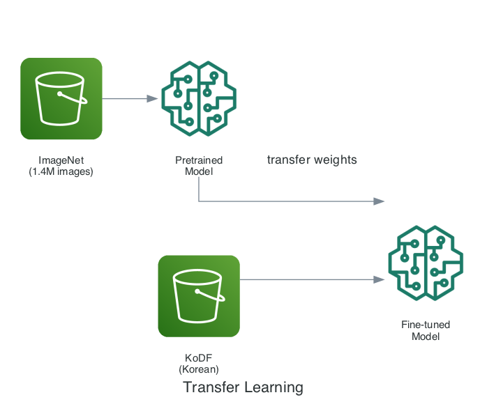
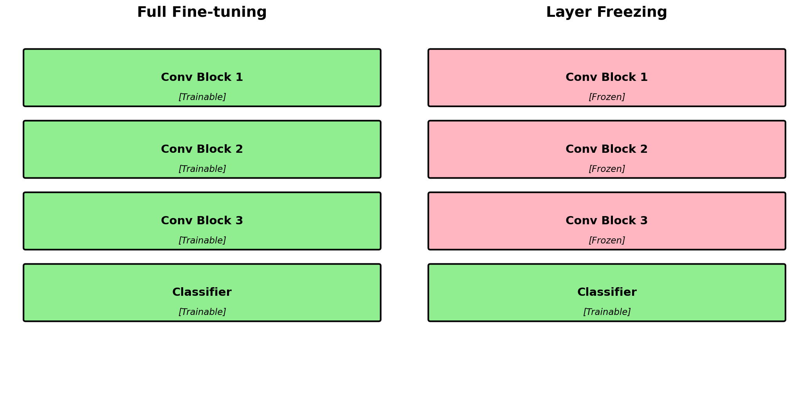
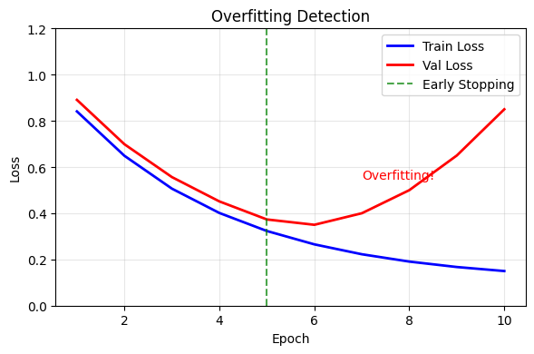
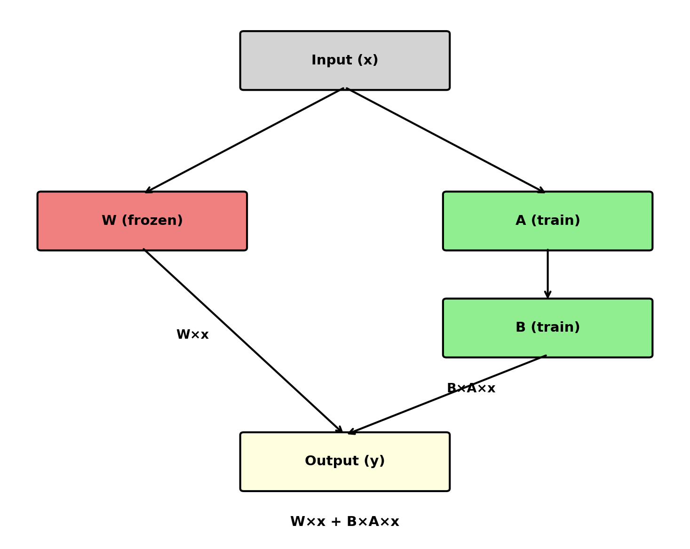
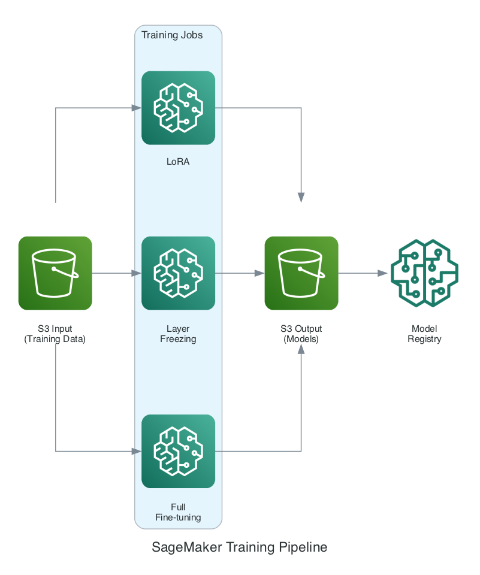

# 3. Fine-tuning (3가지 기법 비교)

> 노트북: `3_fine_tuning/run_finetuning.ipynb`

## 개요

Amazon SageMaker를 활용하여 KoDF 데이터셋으로 모델을 Fine-tuning합니다.
**3가지 Fine-tuning 기법**을 비교하여 각각의 장단점을 이해합니다.

## 학습 내용

- **Transfer Learning과 Fine-tuning 개념**
- **3가지 Fine-tuning 기법 비교** (Full, Freeze, LoRA)
- SageMaker Training Job 구성
- SageMaker Experiments로 실험 추적
- Spot Instance로 비용 절감

---

## Transfer Learning이란?

### 왜 Fine-tuning이 필요한가?



대규모 데이터셋(ImageNet)에서 학습된 일반적인 특징을 활용하여, 소규모 타겟 데이터셋(KoDF)에 특화된 모델을 효율적으로 학습할 수 있습니다.

### CNN의 계층별 학습 특성

| 계층 | 학습하는 특징 | 전이 가능성 |
|------|-------------|------------|
| **초기 층** | 엣지, 색상, 텍스처 | 높음 (범용적) |
| **중간 층** | 눈, 코, 입 형태 | 중간 |
| **후반 층** | 특정 객체/클래스 | 낮음 (태스크 특화) |

> 💡 **핵심**: 초기 층은 재사용하고, 후반 층만 새로 학습하면 효율적!

---

## Fine-tuning 기법 비교 (핵심!)

| 기법 | 학습 파라미터 | 장점 | 단점 | 적합한 경우 |
|------|--------------|------|------|------------|
| **Full Fine-tuning** | 전체 (~4M) | 최고 성능 | 과적합 위험, 느림 | 데이터 충분, 성능 중요 |
| **Layer Freezing** | Classifier만 (~2K) | 빠름, 안정적 | 성능 제한 | 데이터 적음, 빠른 실험 |
| **LoRA** | Adapter (~10K) | 효율적, 좋은 성능 | 구현 복잡 | 대규모 모델, LLM |

---

## 1. Full Fine-tuning

### 개념

모든 파라미터를 학습합니다. 가장 높은 성능을 낼 수 있지만 과적합 위험이 있습니다.



### 과적합(Overfitting) 위험



**과적합 방지 전략:**
- Data Augmentation (회전, 반전, 색상 변환)
- Dropout, Weight Decay
- Early Stopping
- 작은 Learning Rate (0.0001)

---

## 2. Layer Freezing (Feature Extraction)

### 개념

Backbone(특징 추출기)은 동결하고 Classifier만 학습합니다. (위 Layer Freezing 그림 참조)

### 왜 동결하는가?

```python
# Backbone의 사전학습된 특징을 보존
for param in model.backbone.parameters():
    param.requires_grad = False  # 그래디언트 계산 안 함

# Classifier만 학습
for param in model.backbone.classifier.parameters():
    param.requires_grad = True
```

**장점:** 빠르고 안정적, 적은 데이터에서도 잘 동작
**단점:** 성능 상한이 있음 (Backbone이 고정되므로)

---

## 3. LoRA (Low-Rank Adaptation)

### 핵심 아이디어

큰 가중치 행렬의 변화량(ΔW)을 **저차원(Low-Rank) 행렬의 곱**으로 근사합니다.

| 구분 | 수식 | 파라미터 수 |
|------|------|------------|
| **기존 방식** | W' = W + ΔW | d × d (매우 많음) |
| **LoRA 방식** | W' = W + B × A | d × r + r × d (적음) |

> **핵심**: ΔW를 두 개의 작은 행렬 B(d×r)와 A(r×d)의 곱으로 분해 (r << d)

**예시** (d=1000, r=8):
- 기존: 1000 × 1000 = **1,000,000** 파라미터
- LoRA: 1000 × 8 + 8 × 1000 = **16,000** 파라미터 (**1.6%**)

### LoRA 구조



### LoRA 코드

```python
class LoRALayer(nn.Module):
    def __init__(self, original_layer, rank=8):
        super().__init__()
        self.original_layer = original_layer

        # 원본 동결
        for param in self.original_layer.parameters():
            param.requires_grad = False

        in_features = original_layer.in_features
        out_features = original_layer.out_features

        # LoRA 행렬 (학습 가능)
        self.lora_A = nn.Linear(in_features, rank, bias=False)
        self.lora_B = nn.Linear(rank, out_features, bias=False)

        # 초기화: A는 정규분포, B는 0
        nn.init.normal_(self.lora_A.weight, std=0.02)
        nn.init.zeros_(self.lora_B.weight)

    def forward(self, x):
        # W×x + B×A×x
        return self.original_layer(x) + self.lora_B(self.lora_A(x))
```

### LoRA 가중치 병합 (추론 시)

학습 후 배포를 위해 LoRA 가중치를 원본에 병합:

```python
def merge_lora_weights(model):
    # W' = W + B × A
    merged_weight = W + (B.weight @ A.weight)
    # 이제 표준 Linear 레이어로 사용 가능
```

---

## 아키텍처



---

## 주요 코드

### 기법 선택

```python
METHODS = {
    'full': True,    # Full Fine-tuning
    'freeze': True,  # Layer Freezing
    'lora': True     # LoRA
}
```

### 기법별 Estimator 설정

```python
def create_estimator(method: str) -> PyTorch:
    hyperparameters = {
        'epochs': 5,
        'batch-size': 32,
        'learning-rate': 0.0001,
        'model-name': 'efficientnet_b0',
        'finetune-method': method
    }

    if method == 'lora':
        hyperparameters['lora-rank'] = 8

    return PyTorch(
        entry_point='train.py',
        source_dir='3_fine_tuning',
        instance_type='ml.g4dn.xlarge',
        hyperparameters=hyperparameters,
        use_spot_instances=True,
        max_wait=7200,
    )
```

---

## Spot Instance 비용

| 기법 | 소요 시간 | Spot 비용 |
|------|----------|-----------|
| Full | ~15분 | ~$0.055 |
| Freeze | ~10분 | ~$0.037 |
| LoRA | ~12분 | ~$0.044 |
| **총합** | ~37분 | **~$0.14** |

---

## 체크포인트

- [ ] 실행할 기법 선택
- [ ] Training Job 실행
- [ ] 학습 완료 확인

## 다음 단계

[4. After 평가](04-after-evaluation.md)로 이동합니다.
